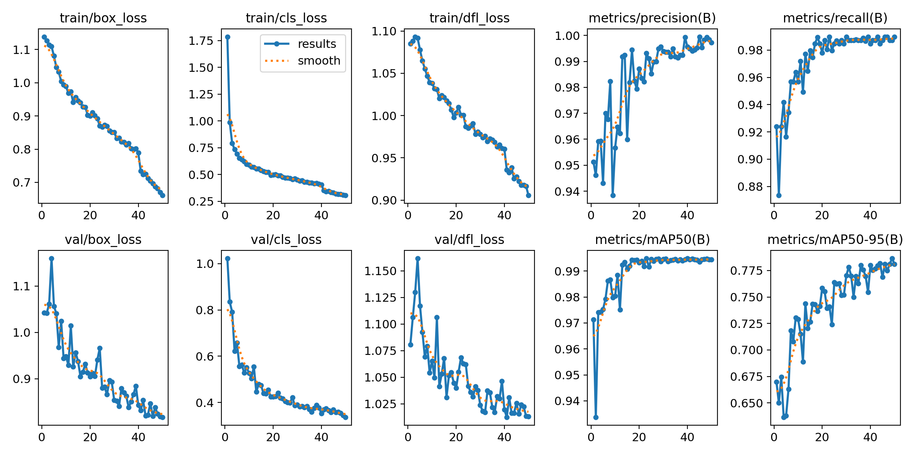

# Detecção de Placas Veiculares com YOLOv11 e HOG + SVM

<p align="center">
  
</p>

<p align="center">
  
</p>

Projeto desenvolvido para a disciplina de **Machine Learning**, com o objetivo de comparar uma abordagem baseada em **Deep Learning** e uma abordagem clássica de **Machine Learning** para detecção de placas veiculares.

O trabalho compara dois modelos treinados separadamente:

* **YOLOv11**, utilizado como detector de objetos;
* **HOG + SVM**, utilizado como abordagem clássica de Machine Learning, treinado com recortes de placa e não placa e aplicado como detector por meio de **Sliding Window**.

---

## Objetivo

Desenvolver um sistema capaz de:

* Detectar automaticamente a região da placa em uma imagem de veículo;
* Comparar o desempenho entre dois modelos distintos:

  * **YOLOv11**, como modelo de Deep Learning para detecção de objetos;
  * **HOG + SVM**, como modelo clássico de Machine Learning aplicado à detecção por janelas deslizantes;
* Avaliar qual abordagem apresenta melhor desempenho na localização da placa na imagem completa.

Além disso, o projeto conta com uma interface desenvolvida em **Streamlit**, permitindo que o usuário envie uma imagem e visualize os resultados produzidos pelos dois modelos.

---

## Dataset

Foi utilizado um dataset contendo imagens reais de veículos com suas respectivas anotações no formato YOLO.

### Estrutura do conjunto de dados

| Conjunto    | Quantidade    |
| ----------- | ------------- |
| Treinamento | 4.292 imagens |
| Validação   | 391 imagens   |
| Teste       | 276 imagens   |

Para o treinamento do HOG + SVM, foram gerados automaticamente recortes positivos, contendo placas, e negativos, contendo regiões sem placa, a partir das anotações do YOLO.

---

## Modelos Utilizados

### YOLOv11

Modelo baseado em Deep Learning utilizado para localizar automaticamente a placa na imagem completa.

**Função principal:**

* Receber a imagem completa como entrada;
* Detectar a posição da placa;
* Gerar a bounding box da região detectada.

O YOLOv11 foi treinado com imagens anotadas no formato YOLO, contendo uma única classe: `placa`.

---

### HOG + SVM

Abordagem clássica de Machine Learning composta por:

* Extração de características utilizando **HOG** (Histogram of Oriented Gradients);
* Classificação utilizando **SVM** (Support Vector Machine).

O HOG + SVM foi treinado separadamente como classificador de recortes, utilizando exemplos das classes `placa` e `nao_placa`.

Para permitir a comparação com o YOLOv11 na tarefa de detecção, o HOG + SVM foi aplicado sobre a imagem completa utilizando a técnica de **Sliding Window**. Nesse processo, a imagem é varrida por várias janelas em diferentes escalas, e cada região é classificada pelo SVM como placa ou não placa.

Dessa forma, os dois modelos foram avaliados com o objetivo de localizar a placa na imagem completa.

---

## Fluxo do Sistema

```text
Imagem de entrada
        │
        ├───────────────► YOLOv11
        │                 Detecta diretamente a placa
        │
        └───────────────► HOG + SVM
                          Varre a imagem com Sliding Window
                          e classifica cada região como placa ou não placa
        │
        ▼
Comparação dos resultados
```

---

## Resultados Obtidos

### YOLOv11

O YOLOv11 apresentou alto desempenho na detecção de placas veiculares:

| Métrica   | Resultado |
| --------- | --------- |
| Precision | 99,85%    |
| Recall    | 99,28%    |
| mAP@50    | 99,50%    |
| mAP@50-95 | 82,63%    |

A matriz de confusão do YOLOv11 indicou:

| Resultado             | Quantidade |
| --------------------- | ---------- |
| Verdadeiros Positivos | 391        |
| Falsos Positivos      | 7          |
| Falsos Negativos      | 4          |

---

### HOG + SVM como classificador

Como classificador de recortes, o HOG + SVM obteve excelente desempenho:

| Métrica  | Resultado |
| -------- | --------- |
| Acurácia | 99,82%    |
| Precisão | 100,00%   |
| Recall   | 99,64%    |
| F1-score | 99,82%    |

### Matriz de Confusão do HOG + SVM

|                | Predito Não Placa | Predito Placa |
| -------------- | ----------------- | ------------- |
| Real Não Placa | 270               | 0             |
| Real Placa     | 1                 | 275           |

Total de amostras avaliadas: **546**.

Apenas **uma classificação incorreta** foi observada no conjunto de teste.

---

### HOG + SVM como detector por Sliding Window

Ao ser aplicado como detector na imagem completa, o HOG + SVM apresentou desempenho inferior ao YOLOv11:

| Métrica     | Resultado      |
| ----------- | -------------- |
| TP          | 127            |
| FP          | 138            |
| FN          | 149            |
| Precision   | 47,92%         |
| Recall      | 46,01%         |
| F1-score    | 46,95%         |
| IoU médio   | 36,99%         |
| Tempo médio | 10,27 s/imagem |

---

## Comparação entre os Modelos

| Característica          | YOLOv11                                       | HOG + SVM                                                     |
| ----------------------- | --------------------------------------------- | ------------------------------------------------------------- |
| Tipo                    | Deep Learning                                 | Machine Learning clássico                                     |
| Entrada                 | Imagem completa                               | Imagem completa                                               |
| Estratégia              | Detecção direta de objetos                    | Sliding Window + classificação SVM                            |
| Função                  | Localizar a placa diretamente                 | Varrer a imagem e classificar regiões como placa ou não placa |
| Precision como detector | 99,85%                                        | 47,92%                                                        |
| Recall como detector    | 99,28%                                        | 46,01%                                                        |
| F1-score como detector  | —                                             | 46,95%                                                        |
| mAP@50                  | 99,50%                                        | —                                                             |
| IoU médio               | —                                             | 36,99%                                                        |
| Tempo médio             | Baixo                                         | 10,27 s/imagem                                                |
| Principal vantagem      | Detecta a placa diretamente com alta precisão | Modelo simples, clássico e interpretável                      |
| Principal limitação     | Maior custo de treinamento                    | Detecção mais lenta e menos precisa na imagem completa        |

---

## Análise Comparativa

O YOLOv11 apresentou o melhor desempenho geral para a tarefa de detecção de placas veiculares. Por ser um modelo próprio para detecção de objetos, ele conseguiu localizar as placas diretamente na imagem completa, com alta precisão, alto recall e baixo número de erros.

O HOG + SVM apresentou excelente desempenho como classificador de recortes, alcançando aproximadamente 99,82% de acurácia. Porém, quando aplicado como detector por Sliding Window, seu desempenho foi reduzido. Isso ocorre porque o modelo precisa avaliar várias regiões da imagem, tornando o processo mais sensível ao tamanho das janelas, à escala da placa e à posição do veículo.

Assim, a comparação demonstrou que o HOG + SVM funciona bem como abordagem clássica de classificação, mas o YOLOv11 é mais adequado para a tarefa de detecção direta de placas.

---

## Estrutura do Projeto

```text
deteccao-placas-ml/
│
├── app.py
├── requirements.txt
├── README.md
│
├── models/
│   ├── best.pt
│   └── svm_model.pkl
│
├── notebooks/
│   └── notebook-machine-learning.ipynb
│
├── results/
│   ├── comparacao_modelos.csv
│   ├── resultados_yolo.csv
│   ├── resultados_hog_svm_detector.csv
│   ├── metricas_svm.csv
│   ├── metricas_hog_svm_detector.csv
│   ├── confusion_matrix_svm.png
│   ├── confusion_matrix.png
│   ├── results.csv
│   ├── results.png
│   ├── BoxF1_curve.png
│   ├── BoxP_curve.png
│   ├── BoxPR_curve.png
│   └── BoxR_curve.png
│
└── examples/
    ├── 001.jpg
    ├── 002.jpg
    ├── 003.jpg
    ├── 004.jpg
    ├── 005.jpg
    ├── 006.jpg
    ├── 007.jpg
    ├── 008.jpg
    ├── 009.jpg
    ├── 010.jpg
    ├── 011.jpg
    ├── 012.jpg
    ├── 013.jpg
    ├── 014.jpg
    └── 015.jpg
```

---

## Tecnologias Utilizadas

* Python 3
* Ultralytics YOLOv11
* OpenCV
* Scikit-Learn
* Scikit-Image
* NumPy
* Pandas
* Matplotlib
* Joblib
* Streamlit

---

## Executando o Projeto

### 1. Clone o repositório

```bash
git clone https://github.com/joaomarcos320307/deteccao-placas-ml.git
cd deteccao-placas-ml
```

### 2. Instale as dependências

```bash
pip install -r requirements.txt
```

### 3. Execute a aplicação

```bash
streamlit run app.py
```

---

## Demonstração

A aplicação permite ao usuário enviar uma imagem de veículo e visualizar:

* A detecção da placa realizada pelo YOLOv11;
* A detecção da placa realizada pelo HOG + SVM com Sliding Window;
* A bounding box gerada por cada modelo;
* O tempo de execução de cada abordagem;
* A comparação entre os dois métodos.

**Observação:** A interface web foi desenvolvida utilizando Streamlit e tem como objetivo demonstrar, de forma interativa, a diferença entre uma abordagem moderna de Deep Learning e uma abordagem clássica de Machine Learning aplicada à visão computacional.

---

## Conclusão

Os resultados obtidos demonstram que o YOLOv11 foi o modelo mais adequado para a tarefa de detecção de placas veiculares. O modelo apresentou alta precisão, alto recall e excelente capacidade de localização da placa na imagem completa.

O HOG + SVM apresentou ótimo desempenho como classificador de recortes, porém apresentou limitações quando utilizado como detector por Sliding Window. Apesar disso, a abordagem clássica foi importante para comparação com um modelo de Deep Learning, evidenciando as diferenças entre técnicas tradicionais de Machine Learning e modelos modernos de detecção de objetos.

Portanto, para a aplicação proposta, o YOLOv11 foi considerado o modelo com melhor desempenho geral.

---

## Autores

Projeto desenvolvido para a disciplina de **Machine Learning**.

**Alunos:**

* João Marcos dos Santos Gil
* Rubens Schueng Netto
* Vitor Manoel Batista Miguel

---

## Observações

O arquivo `models/svm_model.pkl` é armazenado utilizando Git LFS (Large File Storage), devido ao seu tamanho exceder o limite padrão de upload do GitHub.

---

## Licença

Este projeto possui finalidade exclusivamente acadêmica.
