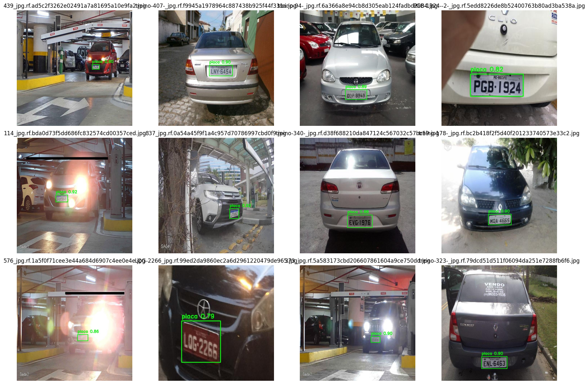

# Detecção de Placas Veiculares com YOLOv11 e HOG + SVM

<p align="center">
  
</p>

Projeto desenvolvido para a disciplina de **Machine Learning**, com o objetivo de comparar uma abordagem baseada em **Deep Learning** (YOLOv11) e uma abordagem clássica de **Machine Learning** (HOG + SVM) para detecção e reconhecimento de placas veiculares.

---

## Objetivo

Desenvolver um sistema capaz de:

- Detectar automaticamente a região da placa em uma imagem de veículo;
- Realizar o recorte da Região de Interesse (ROI);
- Comparar o desempenho entre dois modelos distintos:
  - **YOLOv11** (Detecção de Objetos)
  - **HOG + SVM** (Classificação de Imagens)

Além disso, o projeto conta com uma interface desenvolvida em **Streamlit**, permitindo que o usuário envie uma imagem e visualize os resultados produzidos pelos dois modelos.

---

## Dataset

Foi utilizado um dataset contendo imagens reais de veículos com suas respectivas anotações no formato YOLO.

### Estrutura do conjunto de dados

| Conjunto | Quantidade |
|----------|------------|
| Treinamento | 4.292 imagens |
| Validação | 391 imagens |
| Teste | 276 imagens |

Para o treinamento do HOG + SVM, foram gerados automaticamente recortes positivos (placa) e negativos (não placa) a partir das anotações do YOLO.

---

## Modelos Utilizados

### YOLOv11

Modelo baseado em Deep Learning utilizado para localizar automaticamente a placa na imagem completa.

**Função principal:**
- Detectar a posição da placa;
- Gerar a Bounding Box;
- Realizar o recorte da região detectada.

### HOG + SVM

Abordagem clássica de Machine Learning composta por:

- Extração de características utilizando HOG (Histogram of Oriented Gradients);
- Classificação utilizando Support Vector Machine (SVM).

Neste projeto, o modelo HOG + SVM é utilizado como uma abordagem clássica de Machine Learning para validar o recorte da região detectada pelo YOLOv11, classificando-a como placa ou não placa.

---

## Fluxo do Sistema

```
Imagem de entrada
        │
        ▼
    YOLOv11
(Localiza a placa)
        │
        ▼
Recorte da Região
        │
        ▼
   HOG + SVM
(Classifica o recorte)
        │
        ▼
Exibição dos resultados
```

---

## Resultados Obtidos

### YOLOv11

| Métrica | Resultado |
|----------|-----------|
| Precision | 99,85% |
| Recall | 99,28% |
| mAP@50 | 99,50% |
| mAP@50-95 | 82,63% |

---

### HOG + SVM

| Métrica | Resultado |
|----------|-----------|
| Acurácia | 99,82% |
| Precisão | 100,00% |
| Recall | 99,64% |
| F1-Score | 99,82% |

---

### Comparação entre os Modelos

| Característica | YOLOv11 | HOG + SVM |
|---------------|---------|-----------|
| Tipo | Deep Learning | Machine Learning clássico |
| Entrada | Imagem completa | Recorte da região |
| Função | Localizar e recortar a placa | Classificar o recorte como placa ou não placa |
| Precision | 99,85% | 100,00% |
| Recall | 99,28% | 99,64% |
| F1-score | — | 99,82% |
| Principal vantagem | Detecta a placa diretamente na imagem | Modelo simples e interpretável |
| Principal limitação | Maior custo computacional | Não localiza a placa sozinho |

---

### Matriz de Confusão do HOG + SVM

|               | Predito Não Placa | Predito Placa |
|---------------|------------------|---------------|
| Real Não Placa | 270 | 0 |
| Real Placa | 1 | 275 |

Total de amostras avaliadas: **546**

Apenas **uma classificação incorreta** foi observada no conjunto de teste.

---

## Estrutura do Projeto

```
deteccao-placas-ml/
│
├── app.py
├── requirements.txt
├── README.md
│
├── models/
│   ├── best.pt
│   └── svm_model.pkl
│
├── notebooks/
│   └── notebook-machine-learning.ipynb
│
├── results/
│   ├── comparacao_modelos.csv
│   ├── resultados_yolo.csv
│   ├── metricas_svm.csv
│   ├── confusion_matrix_svm.png
│   ├── results.csv
│   ├── results.png
│   ├── confusion_matrix.png
│   ├── BoxF1_curve.png
│   ├── BoxP_curve.png
│   ├── BoxPR_curve.png
│   └── BoxR_curve.png
│
└── examples/
    ├── 001.jpg
    ├── 002.jpg
    ├── 003.jpg
    ├── 004.jpg
    ├── 005.jpg
    ├── 006.jpg
    ├── 007.jpg
    ├── 008.jpg
    ├── 009.jpg
    ├── 010.jpg
    ├── 011.jpg
    ├── 012.jpg
    ├── 013.jpg
    ├── 014.jpg
    └── 015.jpg
```

---

## Tecnologias Utilizadas

- Python 3
- Ultralytics YOLOv11
- OpenCV
- Scikit-Learn
- Scikit-Image
- NumPy
- Pandas
- Matplotlib
- Joblib
- Streamlit

---

## Executando o Projeto

### 1. Clone o repositório

```bash
git clone https://github.com/joaomarcos320307/deteccao-placas-ml.git
cd deteccao-placas-ml
```

### 2. Instale as dependências

```bash
pip install -r requirements.txt
```

### 3. Execute a aplicação

```bash
streamlit run app.py
```

---

## Demonstração

A aplicação permite ao usuário enviar uma imagem de veículo e visualizar:

- A detecção da placa realizada pelo YOLOv11;
- O recorte automático da região detectada;
- A classificação do recorte utilizando HOG + SVM;
- A comparação entre as duas abordagens de Machine Learning.

**Observação:** A interface web foi desenvolvida utilizando Streamlit e tem como objetivo demonstrar, de forma interativa, a comparação entre as abordagens YOLOv11 e HOG + SVM.

---

## Conclusão

Os resultados obtidos demonstram que ambas as abordagens apresentaram excelente desempenho para a tarefa proposta. Enquanto o YOLOv11 se destacou na localização automática da placa na imagem completa, o HOG + SVM mostrou-se altamente eficiente na classificação dos recortes gerados, alcançando aproximadamente 99,8% de acurácia no conjunto de teste.

O projeto evidencia a aplicação prática de técnicas de Deep Learning e Machine Learning clássico em problemas reais de visão computacional.

---

## Autores

Projeto desenvolvido para a disciplina de **Machine Learning**.

**Alunos:**
- João Marcos dos Santos Gil
- Rubens Schueng Netto
- Vitor Manoel Batista Miguel

---

## Observações

O arquivo `models/svm_model.pkl` é armazenado utilizando Git LFS (Large File Storage), devido ao seu tamanho exceder o limite padrão de upload do GitHub.

---

## Licença

Este projeto possui finalidade exclusivamente acadêmica.
